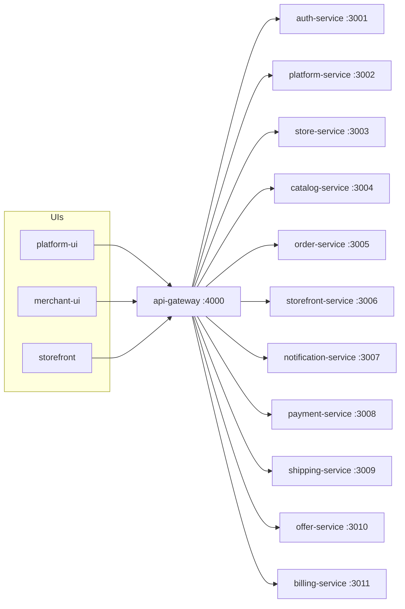

# Knowledge graph — platform-ui




## This repo

```mermaid
flowchart TD
  APP[app/(superadmin) pages]
  APP --> API[lib/api.ts]
  API --> GW[api-gateway]
  AUTH[lib/auth-store.ts] --> API
```

## Superadmin pages (`app/(superadmin)/`)

`dashboard`, `stores`, `admins`, `superadmins`, `customers`, `subscriptions` (plus `features`, `discounts`), `services`, `templates`, `setup-wizard`, `payment`, `notifications`, `firebase`, `support`, `cleanup`, `settings` (plus `info-content`).

## Task → file

- New console page: `app/(superadmin)/<name>/page.tsx` + `components/layout/Sidebar.tsx`.
- Platform API: typically `/platform/...` via `lib/api.ts`.
